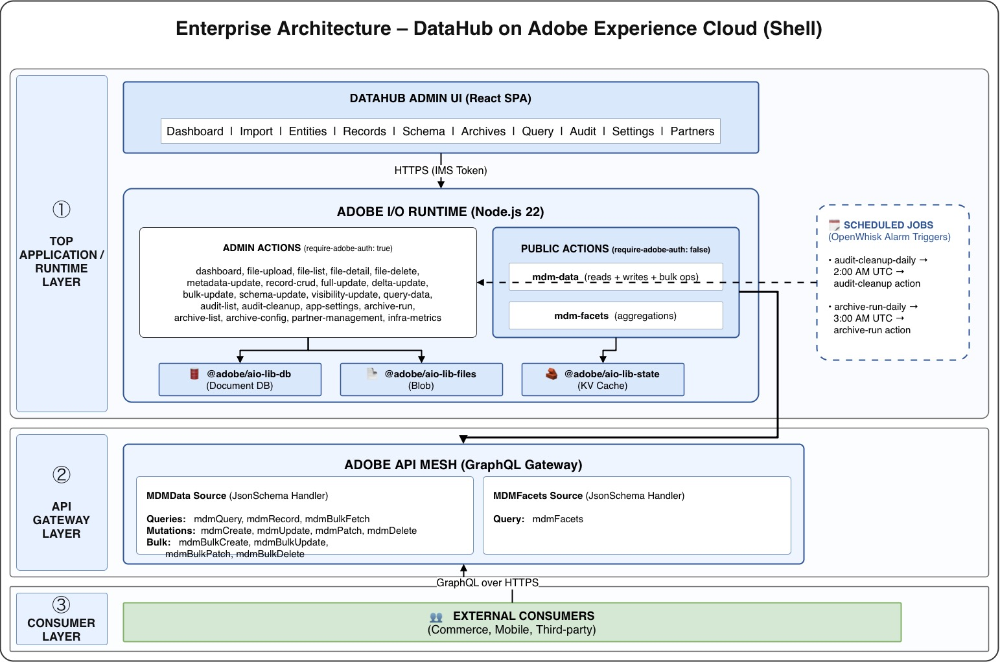

# DataHub — Architecture Document

> System architecture, component diagrams, integration map, and feature flow charts.
>
> For developer setup, project structure, and troubleshooting, see [TECHNICAL.md](TECHNICAL.md).

---

## Table of Contents

- [1. High-Level Architecture](#1-high-level-architecture)
- [2. Technology Stack](#2-technology-stack)
- [3. System Components](#3-system-components)
  - [3.1 Frontend (React SPA)](#31-frontend-react-spa)
  - [3.2 Backend (Adobe I/O Runtime Actions)](#32-backend-adobe-io-runtime-actions)
  - [3.3 Database (aio-lib-db)](#33-database-aio-lib-db)
  - [3.4 File Storage (aio-lib-files)](#34-file-storage-aio-lib-files)
  - [3.5 Cache Layer (aio-lib-state)](#35-cache-layer-aio-lib-state)
  - [3.6 API Gateway (Adobe API Mesh)](#36-api-gateway-adobe-api-mesh)
  - [3.7 Scheduler (Alarm Triggers)](#37-scheduler-alarm-triggers)
  - [3.8 Authentication (Adobe IMS)](#38-authentication-adobe-ims)
- [4. Integration Map](#4-integration-map)
- [5. Data Model](#5-data-model)
- [6. Feature Flows (Grouped by Feature)](#6-feature-flows-grouped-by-feature)
  - [6.1 CSV Import & Entity Creation](#61-csv-import--entity-creation)
  - [6.2 Data Query (Admin)](#62-data-query-admin)
  - [6.3 Public API — Read via API Mesh](#63-public-api--read-via-api-mesh)
  - [6.4 Public API — Write (CRUD) via API Mesh](#64-public-api--write-crud-via-api-mesh)
  - [6.5 Public API — Bulk Operations via API Mesh](#65-public-api--bulk-operations-via-api-mesh)
  - [6.6 Full Update (Dataset Replacement)](#66-full-update-dataset-replacement)
  - [6.7 Delta Update (Incremental Sync)](#67-delta-update-incremental-sync)
  - [6.8 Record CRUD (Admin UI)](#68-record-crud-admin-ui)
  - [6.9 Schema Management](#69-schema-management)
  - [6.10 Archival System](#610-archival-system)
  - [6.11 Faceted Search & Aggregations](#611-faceted-search--aggregations)
  - [6.12 Audit Trail](#612-audit-trail)
  - [6.13 Dashboard & Metrics](#613-dashboard--metrics)
  - [6.14 Partner Management](#614-partner-management)
  - [6.15 App Settings](#615-app-settings)
  - [6.16 Scheduled Jobs](#616-scheduled-jobs)
  - [6.17 Visibility & Access Control](#617-visibility--access-control)
  - [6.19 User Session Management](#619-user-session-management)
  - [6.20 Event Publishing](#620-event-publishing)
- [7. Security Architecture](#7-security-architecture)
- [8. Caching Strategy](#8-caching-strategy)
- [9. Deployment Architecture](#9-deployment-architecture)

---

## 1. High-Level Architecture



<details>
<summary>ASCII version (text-based)</summary>

```
┌───────────────────────────────────────────────────────────────────────────────────────┐
│                           ADOBE EXPERIENCE CLOUD SHELL                                │
│                                                                                       │
│  ┌─────────────────────────────────────────────────────────────────────────────────┐  │
│  │                          DATAHUB ADMIN UI (React SPA)                           │  │
│  │                                                                                 │  │
│  │  Dashboard │ Import │ Entities │ Records │ Schema │ Archives │ Query │  │
│  │  Audit │ Settings │ Partners                                                    │  │
│  └──────────────────────────────────┬──────────────────────────────────────────────┘  │
│                                     │ HTTPS (IMS Token)                               │
│  ┌──────────────────────────────────▼──────────────────────────────────────────────┐  │
│  │                     ADOBE I/O RUNTIME (Node.js 22)                              │  │
│  │                                                                                 │  │
│  │  ┌──────────────────────────────────────────────────────────────────────────┐   │  │
│  │  │  ADMIN ACTIONS (require-adobe-auth: true) — 20 actions                   │   │  │
│  │  │  dashboard│file-upload│file-list│file-detail│file-delete│metadata-update  │   │  │
│  │  │  record-crud│full-update│delta-update│bulk-update│schema-update           │   │  │
│  │  │  visibility-update│query-data                                        │   │  │
│  │  │  audit-list│audit-cleanup│app-settings│archive-run│archive-list           │   │  │
│  │  │  archive-config│partner-management│infra-metrics                          │   │  │
│  │  └──────────────────────────────────────────────────────────────────────────┘   │  │
│  │                                                                                 │  │
│  │  ┌──────────────────────────────────────────────────────────────────────────┐   │  │
│  │  │  PUBLIC ACTIONS (require-adobe-auth: false) — 2 actions                  │   │  │
│  │  │  mdm-data (reads + writes + bulk ops) │ mdm-facets (aggregations)        │   │  │
│  │  └──────────────────────┬────────────────────────────┬──────────────────────┘   │  │
│  │                         │                            │                          │  │
│  │     ┌───────────────────▼──┐  ┌──────────────────┐  │  ┌───────────────────┐   │  │
│  │     │  @adobe/aio-lib-db   │  │ @adobe/aio-lib-  │  │  │ @adobe/aio-lib-   │   │  │
│  │     │  (Document DB)       │  │ files (Blob)     │  │  │ state (KV Cache)  │   │  │
│  │     └──────────────────────┘  └──────────────────┘  │  └───────────────────┘   │  │
│  │                                                      │                          │  │
│  └──────────────────────────────────────────────────────┼──────────────────────────┘  │
│                                                         │                             │
├─────────────────────────────────────────────────────────┼─────────────────────────────┤
│                       ADOBE API MESH (GraphQL Gateway)  │                             │
│                                                         │                             │
│  ┌──────────────────────────────────────────────────────▼──────────────────────────┐  │
│  │  MDMData Source (JsonSchema Handler)                                             │  │
│  │  Queries: mdmQuery, mdmRecord, mdmBulkFetch                                    │  │
│  │  Mutations: mdmCreate, mdmUpdate, mdmPatch, mdmDelete                          │  │
│  │  Bulk: mdmBulkCreate, mdmBulkUpdate, mdmBulkPatch, mdmBulkDelete              │  │
│  ├─────────────────────────────────────────────────────────────────────────────────┤  │
│  │  MDMFacets Source (JsonSchema Handler)                                          │  │
│  │  Query: mdmFacets                                                               │  │
│  └─────────────────────────────────────────────────────────────────────────────────┘  │
│                              ▲                                                        │
│                              │ GraphQL over HTTPS                                     │
├──────────────────────────────┼────────────────────────────────────────────────────────┤
│                              │                                                        │
│               EXTERNAL CONSUMERS (Commerce, Mobile, Third-party)                      │
│                                                                                       │
└───────────────────────────────────────────────────────────────────────────────────────┘

         SCHEDULED JOBS (OpenWhisk Alarm Triggers)
         ├── audit-cleanup-daily  → 2:00 AM UTC → audit-cleanup action
         └── archive-run-daily   → 3:00 AM UTC → archive-run action
```

</details>

---

## 2. Technology Stack

| Layer | Technology | Purpose |
|-------|-----------|---------|
| **Hosting** | Adobe Experience Cloud Shell | SSO, navigation, org context |
| **Frontend** | React 16 + React Spectrum 3 | Admin UI (SPA) |
| **Routing** | React Router v6 | Client-side navigation |
| **Backend Runtime** | Adobe I/O Runtime (OpenWhisk) | Serverless functions (Node.js 22) |
| **Database** | `@adobe/aio-lib-db` v1.0.3 | MongoDB-compatible document store |
| **File Storage** | `@adobe/aio-lib-files` (via aio-sdk v6) | Blob storage for CSV, archives |
| **Cache** | `@adobe/aio-lib-state` v5.3.1 | Key-value store with TTL (rate limiting, settings, metrics) |
| **API Gateway** | Adobe API Mesh (JsonSchema handler) | GraphQL public API with CDN caching |
| **Authentication** | Adobe IMS (OAuth 2.0 / JWT) | Admin auth + S2S credentials |
| **Scheduler** | OpenWhisk Alarm Triggers | Cron jobs (audit cleanup, archival) |
| **Bundler** | Webpack (App Builder CLI) | Frontend bundling |
| **Testing** | Jest 29 | Unit + E2E tests |

---

## 3. System Components

### 3.1 Frontend (React SPA)

**Location**: `web-src/src/`

The admin SPA runs inside Adobe Experience Cloud Shell and communicates with backend actions via HTTPS.

| Component | Route | Purpose |
|-----------|-------|---------|
| `Dashboard.js` | `/` | KPI cards, platform status, recent activity |
| `FileUpload.js` | `/upload` | CSV import wizard with schema detection |
| `FileList.js` | `/files` | Entity listing with search/sort/bulk actions |
| `FileDetail.js` | `/files/:entity` | Entity detail with tabbed view |
| `RecordManager.js` | `/files/:entity/records` | Record CRUD data grid |
| `SchemaManager.js` | `/files/:entity/schema` | Schema field editor + facet config |
| `ArchiveManager.js` | `/files/:entity/archives` | Archive config + download links |
| `QueryConsole.js` | `/api-console` | Ad-hoc query builder |
| `AuditLogs.js` | `/audit` | Activity log viewer |
| `AppSettings.js` | `/settings` | Global settings panel |
| `PartnerConsole.js` | `/partners` | Partner credential management |
| `AdminConsole.js` | `/admin` | Admin tools (infra metrics) |

**State Management**: No global store. Each component uses `useState`/`useEffect` with direct `fetch()` to action endpoints defined in `config.json`.

**Notification System**: `NotificationProvider.js` provides React Context for toast notifications across all components.

### 3.2 Backend (Adobe I/O Runtime Actions)

**Location**: `actions/`

24 serverless actions organized by feature domain:

| Category | Actions | Auth |
|----------|---------|------|
| **Dashboard** | `dashboard`, `infra-metrics` | IMS |
| **Data Import** | `file-upload`, `full-update`, `delta-update`, `bulk-update` | IMS |
| **Entity Management** | `file-list`, `file-detail`, `file-delete`, `metadata-update` | IMS |
| **Record CRUD** | `record-crud` | IMS |
| **Schema** | `schema-update`, `visibility-update` | IMS |
| **Archival** | `archive-run`, `archive-list`, `archive-config` | IMS |
| **Query** | `query-data` | IMS |
| **Public API** | `mdm-data`, `mdm-facets` | None (Mesh) |
| **Audit** | `audit-list`, `audit-cleanup` | IMS |
| **Settings** | `app-settings` | IMS |
| **Partners** | `partner-management` | IMS |
| **Events** | `publish-events` | IMS |

**Shared Utilities**:
- `mdm-utils.js` — DB client, safe queries, CSV parsing, validation, audit logging, partner validation, RBAC, caching, event publishing, rate limiting
- `utils.js` — Generic action helpers (auth, params, logging)

### 3.3 Database (aio-lib-db)

**Provider**: `@adobe/aio-lib-db` — MongoDB-compatible, auto-provisioned by App Builder.

**Region**: `apac` (configurable via `DB_REGION`)

**Collections**:

| Collection | Purpose | Key Fields |
|------------|---------|------------|
| `metadata` | Entity registry — one doc per master | `masterName`, `displayName`, `primaryKey`, `schema`, `visibility`, `crudEnabled`, `facets`, `archival`, `recordCount` |
| `mdm_<masterName>` | Per-master data records | `primaryKey`, `data` (dynamic), `deleted`, `status`, `createdBy`, `updatedBy` |
| `audit` | Activity + event log | `masterName`, `operation`, `actor`, `status`, `timestamp`, `changes` |
| `settings` | App-level configuration | `settingsId`, nested config sections |
| `archives` | Archive job metadata | `archiveId`, `masterName`, `fileName`, `filePath`, `publicUrl`, `expiresAt`, `status` |
| `partners` | Integration partner credentials | `partnerId`, `partnerKey`, `name`, `allowedMasters`, `status` |
| `roles` | User RBAC assignments | `userId`, `role`, `entityRoles` |
| `user_sessions` | IMS user identity cache | `userId`, `email`, `displayName`, `lastActiveAt` |

**Design Pattern — Per-Master Collections**: Each entity gets its own collection (`mdm_products`, `mdm_stores`, etc.) rather than sharing a single `records` collection. This provides better query isolation and index efficiency.

**Known Limitation**: `aio-lib-db` does not reliably support compound filters with booleans. All actions use a JS-level safety filter pattern:
```
DB query: find({ }) → fetch all
JS filter: .filter(r => r.deleted !== true)
```

### 3.4 File Storage (aio-lib-files)

**Provider**: `@adobe/aio-lib-files` (via `@adobe/aio-sdk`)

**Used For**:
- Archived data files (CSV/JSON) with pre-signed download URLs
- Original uploaded CSV file storage (future)

**Operations**: `write`, `read`, `list`, `delete`, `generatePresignURL`

**Path Convention**: `archives/<masterName>/<masterName>-archive-<timestamp>.<ext>`

### 3.5 Cache Layer (aio-lib-state)

**Provider**: `@adobe/aio-lib-state` — Fast key-value store with native TTL expiry.

| Cache Key | TTL | Purpose |
|-----------|-----|---------|
| `dashboard-cache` | Configurable (default 15 min) | Dashboard KPI data |
| `metrics-cache` | Configurable (default 15 min) | Infrastructure metrics |
| `app-settings-cache` | 5 minutes | App settings (read on every request) |
| `rl_<userId>` | 60 seconds | Rate limit counters per user |

**Invalidation**: Write operations call `invalidateMetricsCache()` which sets a 5-second stale TTL (bridge-then-expire pattern).

### 3.6 API Gateway (Adobe API Mesh)

**Configuration**: `mesh/mesh.json`

Two JsonSchema sources that map GraphQL operations to Runtime actions:

**MDMData Source** → `mdm-data` action:
- 3 Queries: `mdmQuery`, `mdmRecord`, `mdmBulkFetch`
- 8 Mutations: `mdmCreate`, `mdmUpdate`, `mdmPatch`, `mdmDelete`, `mdmBulkCreate`, `mdmBulkUpdate`, `mdmBulkPatch`, `mdmBulkDelete`

**MDMFacets Source** → `mdm-facets` action:
- 1 Query: `mdmFacets`

**Key Design Decisions**:
- `data` fields typed as opaque JSON (`{}` in JSON Schema) — entity-agnostic, no Mesh redeployment for new entities
- Auth forwarding: `x-forwarded-authorization`, `x-forwarded-x-partner-id`, `x-forwarded-x-partner-key`
- Response caching: `max-age=60` (browser), `s-maxage=120` (CDN edge)

### 3.7 Scheduler (Alarm Triggers)

Deployed by `hooks/post-app-deploy.js` (not in `app.config.yaml`):

| Trigger | Schedule | Action | Purpose |
|---------|----------|--------|---------|
| `audit-cleanup-daily` | `0 2 * * *` (2 AM UTC) | `audit-cleanup` | Purge audit logs older than retention period |
| `archive-run-daily` | `0 3 * * *` (3 AM UTC) | `archive-run` | Archive records exceeding threshold + cleanup expired archives |

### 3.8 Authentication (Adobe IMS)

```
┌──────────────┐    IMS Token     ┌──────────────────────┐
│  Admin User  │ ────────────────▶│  Experience Cloud    │
│  (Browser)   │                  │  Shell (SSO)         │
└──────────────┘                  └──────────┬───────────┘
                                             │ Bearer Token
                                  ┌──────────▼───────────┐
                                  │  I/O Runtime Gateway  │
                                  │  (require-adobe-auth) │
                                  └──────────┬───────────┘
                                             │ Validated
                                  ┌──────────▼───────────┐
                                  │  Action (params with  │
                                  │  __ow_headers.auth)   │
                                  └──────────────────────┘

┌──────────────┐  Partner Headers  ┌──────────────────────┐
│  External    │ ─────────────────▶│  API Mesh (GraphQL)  │
│  Consumer    │  x-partner-id     │  Forwards headers    │
└──────────────┘  x-partner-key    └──────────┬───────────┘
                                              │ x-forwarded-*
                                   ┌──────────▼───────────┐
                                   │  mdm-data action     │
                                   │  validatePartner()   │
                                   │  (constant-time key  │
                                   │   comparison)        │
                                   └──────────────────────┘
```

**Three Auth Modes**:
1. **IMS Token** (Admin UI) — `require-adobe-auth: true` on all admin actions
2. **Partner Credentials** (Public API writes) — `x-partner-id` + `x-partner-key` validated in `mdm-data`
3. **No Auth** (Public API reads) — Public masters readable without credentials

---

## 4. Integration Map

```
┌─────────────────────────────────────────────────────────────────────┐
│                        DATAHUB PLATFORM                             │
│                                                                     │
│  ┌───────────┐  ┌────────────┐  ┌───────────┐  ┌──────────────┐   │
│  │ Admin UI  │  │ API Mesh   │  │ Scheduler │  │ Post-Deploy  │   │
│  │ (React)   │  │ (GraphQL)  │  │ (Alarms)  │  │ Hook         │   │
│  └─────┬─────┘  └──────┬─────┘  └─────┬─────┘  └──────┬───────┘   │
│        │               │              │                │           │
│  ┌─────▼───────────────▼──────────────▼────────────────▼───────┐   │
│  │              ADOBE I/O RUNTIME (24 Actions)                  │   │
│  └──┬──────────────┬───────────────┬───────────────┬───────────┘   │
│     │              │               │               │               │
│  ┌──▼──────┐  ┌────▼───────┐  ┌───▼────────┐  ┌───▼────────┐    │
│  │ aio-lib │  │ aio-lib-   │  │ aio-lib-   │  │ Adobe IMS  │    │
│  │ -db     │  │ files      │  │ state      │  │ Profile    │    │
│  │         │  │            │  │            │  │ API        │    │
│  └─────────┘  └────────────┘  └────────────┘  └────────────┘    │
│                                                                     │
└─────────────────────────────────────────────────────────────────────┘

External Integrations:
  1. Adobe Experience Cloud Shell  ← UI hosting, SSO, org context
  2. Adobe IMS (ims-na1.adobelogin.com) ← Token validation, user profile fetch
  3. Adobe API Mesh (edge-sandbox-graph.adobe.io) ← GraphQL gateway
  4. Adobe I/O Runtime (adobeioruntime.net) ← Serverless compute
  5. @adobe/aio-lib-db ← Auto-provisioned document database
  6. @adobe/aio-lib-files ← Auto-provisioned blob storage
  7. @adobe/aio-lib-state ← Auto-provisioned key-value cache
  8. OpenWhisk Alarm System ← Cron trigger scheduling
  9. Adobe I/O Events (future) ← Webhook/event publishing
```

---

## 5. Data Model

### Entity Relationship Diagram

```
┌─────────────────────────┐     1:N     ┌─────────────────────────┐
│       metadata          │─────────────│   mdm_<masterName>      │
│ (Entity Registry)       │             │ (Per-Master Records)    │
│                         │             │                         │
│ masterName (PK)         │             │ primaryKey (PK, unique) │
│ displayName             │             │ data { ... }  (dynamic) │
│ collectionName          │             │ status                  │
│ primaryKey (field name) │             │ deleted (bool)          │
│ schema [ ]              │             │ createdAt / updatedAt   │
│ visibility              │             │ createdBy / updatedBy   │
│ crudEnabled             │             └─────────────────────────┘
│ allowedOperations { }   │
│ facets { }              │
│ archival { }            │
│ recordAudit { }         │
│ recordCount             │
│ api { }                 │
│ governance { }          │
│ createdBy / updatedBy   │
│ createdAt / updatedAt   │
└─────────────────────────┘

┌─────────────────────────┐             ┌─────────────────────────┐
│         audit           │             │       archives          │
│                         │             │                         │
│ timestamp               │             │ archiveId (PK)          │
│ masterName              │             │ masterName (FK)         │
│ operation               │             │ fileName                │
│ actor                   │             │ filePath                │
│ status                  │             │ publicUrl               │
│ affectedRecords         │             │ recordCount             │
│ changes [ ]             │             │ sizeBytes               │
│ recordId (optional)     │             │ format                  │
│ type (optional: event)  │             │ archivedAt              │
│ eventType (optional)    │             │ expiresAt               │
│ payload (optional)      │             │ retentionDays           │
└─────────────────────────┘             │ status (active/expired) │
                                        │ triggeredBy             │
┌─────────────────────────┐             └─────────────────────────┘
│       partners          │
│                         │             ┌─────────────────────────┐
│ partnerId (PK)          │             │       settings          │
│ partnerKey (secret)     │             │                         │
│ name                    │             │ settingsId = 'app-      │
│ description             │             │   settings'             │
│ contactEmail            │             │ general { }             │
│ allowedMasters [ ]      │             │ guardrails { }          │
│ status                  │             │ dataManagement { }      │
│ deleted                 │             │ api { }                 │
└─────────────────────────┘             │ audit { }               │
                                        │ security { }            │
┌─────────────────────────┐             │ ui { }                  │
│        roles            │             │ notifications { }       │
│                         │             │ performance { }         │
│ userId (PK)             │             │ archival { }            │
│ role (admin/editor/     │             └─────────────────────────┘
│       viewer/api-       │
│       consumer)         │             ┌─────────────────────────┐
│ entityRoles { }         │             │    user_sessions        │
│   (per-entity overrides)│             │                         │
└─────────────────────────┘             │ userId (PK)             │
                                        │ email                   │
                                        │ displayName             │
                                        │ registeredAt            │
                                        │ lastActiveAt            │
                                        └─────────────────────────┘
```

---

## 6. Feature Flows (Grouped by Feature)

### 6.1 CSV Import & Entity Creation

**Actions**: `file-upload`
**Components**: `FileUpload.js`

```
┌──────────┐     ┌──────────────┐     ┌──────────────────────────────────────────┐
│  Admin   │     │  FileUpload  │     │            file-upload action            │
│  User    │     │  Component   │     │                                          │
└────┬─────┘     └──────┬───────┘     └──────────────────┬───────────────────────┘
     │                  │                                │
     │  Select CSV      │                                │
     │─────────────────▶│                                │
     │                  │                                │
     │  Configure:      │                                │
     │  - masterName    │                                │
     │  - primaryKey    │                                │
     │  - visibility    │                                │
     │  - facets config │                                │
     │─────────────────▶│                                │
     │                  │                                │
     │                  │  POST csvContent + config      │
     │                  │───────────────────────────────▶│
     │                  │                                │
     │                  │                    ┌───────────▼───────────┐
     │                  │                    │ 1. Validate IMS Token │
     │                  │                    │ 2. Validate master    │
     │                  │                    │    name format        │
     │                  │                    │ 3. Parse CSV headers  │
     │                  │                    │    + records          │
     │                  │                    │ 4. Auto-generate PK   │
     │                  │                    │    if not provided    │
     │                  │                    │ 5. Build schema from  │
     │                  │                    │    CSV headers        │
     │                  │                    │ 6. Validate CSV data  │
     │                  │                    │    against schema     │
     │                  │                    │ 7. Check storage      │
     │                  │                    │    guardrails         │
     │                  │                    │ 8. Check duplicate    │
     │                  │                    │    master name        │
     │                  │                    └───────────┬───────────┘
     │                  │                                │
     │                  │                    ┌───────────▼───────────┐
     │                  │                    │ DB WRITES:            │
     │                  │                    │ 9. Insert metadata    │
     │                  │                    │    → metadata col     │
     │                  │                    │ 10. Create per-master │
     │                  │                    │    collection         │
     │                  │                    │    (mdm_<name>)       │
     │                  │                    │ 11. Batch insert all  │
     │                  │                    │    records            │
     │                  │                    │ 12. Create indexes    │
     │                  │                    │    (PK, deleted,      │
     │                  │                    │     queryable fields) │
     │                  │                    │ 13. Create audit log  │
     │                  │                    │ 14. Invalidate cache  │
     │                  │                    └───────────┬───────────┘
     │                  │                                │
     │                  │  200 { status, master, count } │
     │                  │◀───────────────────────────────│
     │  Success toast   │                                │
     │◀─────────────────│                                │
```

### 6.2 Data Query (Admin)

**Actions**: `query-data`
**Components**: `QueryConsole.js`

```
┌──────────┐     ┌──────────────┐     ┌──────────────────────────────────────────┐
│  Admin   │     │ QueryConsole │     │           query-data action              │
│  User    │     │  Component   │     │                                          │
└────┬─────┘     └──────┬───────┘     └──────────────────┬───────────────────────┘
     │                  │                                │
     │ Select entity    │                                │
     │ Set filters      │                                │
     │ Set page/sort    │                                │
     │─────────────────▶│                                │
     │                  │  GET ?entity=X&filters=...     │
     │                  │───────────────────────────────▶│
     │                  │                                │
     │                  │                    ┌───────────▼───────────┐
     │                  │                    │ 1. Validate IMS Token │
     │                  │                    │ 2. Lookup metadata    │
     │                  │                    │ 3. Fetch ALL records  │
     │                  │                    │    from mdm_<master>  │
     │                  │                    │    (simple query)     │
     │                  │                    │ 4. JS-level filter:   │
     │                  │                    │    - exclude deleted  │
     │                  │                    │    - apply data       │
     │                  │                    │      filters from     │
     │                  │                    │      __ow_query       │
     │                  │                    │ 5. JS-level sort      │
     │                  │                    │ 6. JS-level paginate  │
     │                  │                    │    (slice array)      │
     │                  │                    │ 7. Field selection    │
     │                  │                    │    (project columns)  │
     │                  │                    │ 8. Optional: compute  │
     │                  │                    │    facet aggregations │
     │                  │                    └───────────┬───────────┘
     │                  │                                │
     │                  │  { count, page, total, data }  │
     │                  │◀───────────────────────────────│
     │ Display results  │                                │
     │◀─────────────────│                                │
```

### 6.3 Public API — Read via API Mesh

**Actions**: `mdm-data`, `mdm-facets`
**Integration**: Adobe API Mesh (GraphQL)

```
┌──────────────┐     ┌──────────────────┐     ┌──────────────┐     ┌─────────────┐
│   External   │     │  Adobe API Mesh  │     │  mdm-data    │     │  aio-lib-db │
│   Client     │     │  (GraphQL)       │     │  action      │     │             │
└──────┬───────┘     └────────┬─────────┘     └──────┬───────┘     └──────┬──────┘
       │                      │                      │                    │
       │  GraphQL Query:      │                      │                    │
       │  mdmQuery(           │                      │                    │
       │    master: "products"│                      │                    │
       │    page: 1           │                      │                    │
       │    filters: "..."    │                      │                    │
       │  )                   │                      │                    │
       │─────────────────────▶│                      │                    │
       │                      │                      │                    │
       │                      │  Check CDN cache     │                    │
       │                      │  (max-age=60,        │                    │
       │                      │   s-maxage=120)      │                    │
       │                      │                      │                    │
       │                      │  [Cache MISS]        │                    │
       │                      │  Map GraphQL args    │                    │
       │                      │  to query params     │                    │
       │                      │  Forward headers:    │                    │
       │                      │  x-forwarded-auth    │                    │
       │                      │─────────────────────▶│                    │
       │                      │                      │                    │
       │                      │                      │  Rate limit check  │
       │                      │                      │  (aio-lib-state)   │
       │                      │                      │                    │
       │                      │                      │  Visibility check  │
       │                      │                      │  (public/private)  │
       │                      │                      │                    │
       │                      │                      │  find({})          │
       │                      │                      │───────────────────▶│
       │                      │                      │                    │
       │                      │                      │  All records       │
       │                      │                      │◀───────────────────│
       │                      │                      │                    │
       │                      │                      │  JS filter/sort/   │
       │                      │                      │  paginate          │
       │                      │                      │                    │
       │                      │  JSON response       │                    │
       │                      │  (data as opaque     │                    │
       │                      │   JSON scalars)      │                    │
       │                      │◀─────────────────────│                    │
       │                      │                      │                    │
       │                      │  Cache response      │                    │
       │                      │  at CDN edge         │                    │
       │                      │                      │                    │
       │  GraphQL response    │                      │                    │
       │◀─────────────────────│                      │                    │
```

### 6.4 Public API — Write (CRUD) via API Mesh

**Actions**: `mdm-data`
**Integration**: Adobe API Mesh, Partner Management

```
┌──────────────┐     ┌──────────────────┐     ┌─────────────────────────────────────┐
│   External   │     │  Adobe API Mesh  │     │          mdm-data action            │
│   Client     │     │  (GraphQL)       │     │                                     │
└──────┬───────┘     └────────┬─────────┘     └──────────────────┬──────────────────┘
       │                      │                                  │
       │  GraphQL Mutation:   │                                  │
       │  mdmCreate(          │                                  │
       │    master: "products"│                                  │
       │    input: { data }   │                                  │
       │  )                   │                                  │
       │  Headers:            │                                  │
       │  x-partner-id: ptr_* │                                  │
       │  x-partner-key: pk_* │                                  │
       │─────────────────────▶│                                  │
       │                      │                                  │
       │                      │  Forward all headers             │
       │                      │  POST to mdm-data action         │
       │                      │─────────────────────────────────▶│
       │                      │                                  │
       │                      │                  ┌───────────────▼──────────────────┐
       │                      │                  │ VALIDATION PIPELINE:             │
       │                      │                  │                                  │
       │                      │                  │ 1. Rate limit check              │
       │                      │                  │    (aio-lib-state counter)       │
       │                      │                  │                                  │
       │                      │                  │ 2. Lookup master metadata        │
       │                      │                  │    → must exist + active         │
       │                      │                  │                                  │
       │                      │                  │ 3. Visibility check              │
       │                      │                  │    → must be 'public'            │
       │                      │                  │                                  │
       │                      │                  │ 4. CRUD enabled check            │
       │                      │                  │    → crudEnabled must be true    │
       │                      │                  │                                  │
       │                      │                  │ 5. Partner validation            │
       │                      │                  │    → x-partner-id lookup         │
       │                      │                  │    → constant-time key compare   │
       │                      │                  │    → partner.status = 'active'   │
       │                      │                  │                                  │
       │                      │                  │ 6. Partner authorization          │
       │                      │                  │    → master in allowedMasters[]  │
       │                      │                  │                                  │
       │                      │                  │ 7. Schema validation             │
       │                      │                  │    → required fields             │
       │                      │                  │    → type checks                 │
       │                      │                  │    → pattern/min/max/enum rules  │
       │                      │                  │                                  │
       │                      │                  │ 8. Storage guardrail check       │
       │                      │                  │                                  │
       │                      │                  │ 9. Duplicate PK check (create)   │
       │                      │                  └───────────────┬──────────────────┘
       │                      │                                  │
       │                      │                  ┌───────────────▼──────────────────┐
       │                      │                  │ DB WRITES:                       │
       │                      │                  │ 10. Insert/Update/Delete record  │
       │                      │                  │ 11. Update metadata recordCount  │
       │                      │                  │ 12. Create audit log entry       │
       │                      │                  │ 13. Publish mutation event       │
       │                      │                  │ 14. Invalidate metrics cache     │
       │                      │                  └───────────────┬──────────────────┘
       │                      │                                  │
       │                      │  { success, operation, record }  │
       │                      │◀─────────────────────────────────│
       │  GraphQL response    │                                  │
       │◀─────────────────────│                                  │
```

### 6.5 Public API — Bulk Operations via API Mesh

**Actions**: `mdm-data` (routed via `operation` query param)
**Operations**: `bulkCreate`, `bulkUpdate`, `bulkPatch`, `bulkDelete`

```
┌──────────────┐     ┌──────────────────┐     ┌──────────────────────────────────────┐
│   External   │     │  Adobe API Mesh  │     │           mdm-data action            │
│   Client     │     │                  │     │                                      │
└──────┬───────┘     └────────┬─────────┘     └─────────────────┬────────────────────┘
       │                      │                                 │
       │  mdmBulkCreate(      │                                 │
       │    master: "products"│                                 │
       │    input: {          │                                 │
       │      data: "[...]"   │  (JSON string of array)         │
       │    }                 │                                 │
       │  )                   │                                 │
       │─────────────────────▶│                                 │
       │                      │  POST ?operation=bulkCreate     │
       │                      │─────────────────────────────────▶│
       │                      │                                 │
       │                      │                 ┌───────────────▼───────────────┐
       │                      │                 │ Same validation pipeline as   │
       │                      │                 │ single CRUD (steps 1-6)       │
       │                      │                 │                               │
       │                      │                 │ Then per-item processing:     │
       │                      │                 │                               │
       │                      │                 │ FOR EACH item in array:       │
       │                      │                 │   - Validate schema           │
       │                      │                 │   - Check duplicates          │
       │                      │                 │   - Insert/Update/Delete      │
       │                      │                 │   - Record success or error   │
       │                      │                 │                               │
       │                      │                 │ NO ROLLBACK on partial fail   │
       │                      │                 │ Each item independent         │
       │                      │                 │                               │
       │                      │                 │ Batch DB operations for       │
       │                      │                 │ performance                   │
       │                      │                 │                               │
       │                      │                 │ Audit + event for the batch   │
       │                      │                 └───────────────┬───────────────┘
       │                      │                                 │
       │                      │  { total, succeeded, failed,    │
       │                      │    results: [per-item status] } │
       │                      │◀────────────────────────────────│
       │  GraphQL response    │                                 │
       │◀─────────────────────│                                 │
```

### 6.6 Full Update (Dataset Replacement)

**Actions**: `full-update`
**Components**: `FileUpload.js` (mode: Full Update)

```
┌──────────┐     ┌──────────────────────────────────────────────────────┐
│  Admin   │     │              full-update action                      │
│  User    │     │                                                      │
└────┬─────┘     └──────────────────────┬───────────────────────────────┘
     │                                  │
     │  POST master + csvContent        │
     │─────────────────────────────────▶│
     │                                  │
     │               ┌──────────────────▼──────────────────┐
     │               │ 1. Validate IMS Token               │
     │               │ 2. RBAC: checkPermission(           │
     │               │         user, 'full-update', master)│
     │               │ 3. Lookup master metadata           │
     │               │ 4. Check allowedOperations.fullUpdate│
     │               │ 5. Parse + validate new CSV         │
     │               │ 6. Storage guardrail (net new =     │
     │               │    newRecords - oldRecords)          │
     │               │ 7. INSERT new records first          │
     │               │    (atomic safety)                   │
     │               │ 8. DELETE old records                 │
     │               │ 9. Update metadata (recordCount,     │
     │               │     lastModifiedBy)                   │
     │               │ 10. Create audit log                  │
     │               │ 11. Invalidate cache                  │
     │               └──────────────────┬──────────────────┘
     │                                  │
     │  { status, inserted, deleted }   │
     │◀─────────────────────────────────│
```

### 6.7 Delta Update (Incremental Sync)

**Actions**: `delta-update`
**Modes**: `upsert` (default), `insert-only`, `update-only`, `mixed` (with `_action` column)

```
┌──────────┐     ┌──────────────────────────────────────────────────────┐
│  Admin   │     │              delta-update action                     │
│  User    │     │                                                      │
└────┬─────┘     └──────────────────────┬───────────────────────────────┘
     │                                  │
     │  POST master + csvContent        │
     │  + mode (upsert|insert-only|     │
     │         update-only|mixed)       │
     │─────────────────────────────────▶│
     │                                  │
     │               ┌──────────────────▼──────────────────┐
     │               │ 1. Validate + RBAC                  │
     │               │ 2. Parse CSV                        │
     │               │ 3. Storage guardrail                │
     │               │ 4. Batch-fetch all existing records │
     │               │    (avoid N+1 queries)              │
     │               │ 5. Build existingMap by PK          │
     │               │                                     │
     │               │ FOR EACH CSV row:                   │
     │               │                                     │
     │               │ MODE: upsert                        │
     │               │   exists? → UPDATE : INSERT         │
     │               │                                     │
     │               │ MODE: insert-only                   │
     │               │   exists? → SKIP : INSERT           │
     │               │                                     │
     │               │ MODE: update-only                   │
     │               │   exists? → UPDATE : SKIP           │
     │               │                                     │
     │               │ MODE: mixed (uses _action column)   │
     │               │   _action=CREATE → INSERT           │
     │               │   _action=UPDATE → FULL REPLACE     │
     │               │   _action=PATCH  → MERGE FIELDS     │
     │               │   _action=DELETE → SOFT DELETE       │
     │               │                                     │
     │               │ 6. Update metadata recordCount      │
     │               │ 7. Audit log                        │
     │               └──────────────────┬──────────────────┘
     │                                  │
     │  { inserted, updated, deleted,   │
     │    skipped, errors }             │
     │◀─────────────────────────────────│
```

### 6.8 Record CRUD (Admin UI)

**Actions**: `record-crud`
**Components**: `RecordManager.js`

```
┌──────────┐     ┌──────────────┐     ┌──────────────────────────────────┐
│  Admin   │     │ RecordManager│     │        record-crud action        │
│  User    │     │  Component   │     │                                  │
└────┬─────┘     └──────┬───────┘     └──────────────┬───────────────────┘
     │                  │                            │
     │  Create record   │                            │
     │─────────────────▶│                            │
     │                  │  POST { master, operation: │
     │                  │    'create', data: {...} } │
     │                  │───────────────────────────▶│
     │                  │                            │
     │                  │             ┌──────────────▼───────────────┐
     │                  │             │ 1. Validate IMS Token       │
     │                  │             │ 2. RBAC: checkPermission()  │
     │                  │             │ 3. Lookup master metadata   │
     │                  │             │ 4. Check crudEnabled        │
     │                  │             │ 5. Check allowedOperations  │
     │                  │             │ 6. Validate required fields │
     │                  │             │ 7. Strip system audit fields│
     │                  │             │ 8. validateRecord() against │
     │                  │             │    schema rules (pattern,   │
     │                  │             │    min/max, enum, length)   │
     │                  │             │ 9. Storage guardrail        │
     │                  │             │ 10. Inject audit fields     │
     │                  │             │     (_createdAt, _createdBy)│
     │                  │             │ 11. Insert into per-master  │
     │                  │             │     collection              │
     │                  │             │ 12. Update recordCount      │
     │                  │             │ 13. Audit log               │
     │                  │             │ 14. Publish mutation event  │
     │                  │             └──────────────┬───────────────┘
     │                  │                            │
     │                  │  { status, record }        │
     │                  │◀───────────────────────────│
     │  Update grid     │                            │
     │◀─────────────────│                            │

  Operations: create | update (full replace) | patch (merge) | delete (soft)
```

### 6.9 Schema Management

**Actions**: `schema-update`, `visibility-update`
**Components**: `SchemaManager.js`

```
┌──────────┐     ┌──────────────┐     ┌───────────────────────────────────────┐
│  Admin   │     │SchemaManager │     │         schema-update action          │
│  User    │     │  Component   │     │                                       │
└────┬─────┘     └──────┬───────┘     └──────────────────┬────────────────────┘
     │                  │                                │
     │  Modify field    │                                │
     │─────────────────▶│                                │
     │                  │  POST { master, operation,     │
     │                  │    field: { name, type, ... }} │
     │                  │───────────────────────────────▶│
     │                  │                                │
     │                  │             ┌──────────────────▼──────────────────┐
     │                  │             │ Operations:                         │
     │                  │             │                                     │
     │                  │             │ ADD:                                │
     │                  │             │  - Check maxSchemaFields limit      │
     │                  │             │  - Append field to schema array     │
     │                  │             │  - Migrate records with default val │
     │                  │             │                                     │
     │                  │             │ UPDATE:                             │
     │                  │             │  - Modify type/required/queryable/  │
     │                  │             │    facetable/editable               │
     │                  │             │  - Cannot change PK field type      │
     │                  │             │                                     │
     │                  │             │ REMOVE:                             │
     │                  │             │  - Cannot remove PK field           │
     │                  │             │  - Remove from schema array         │
     │                  │             │                                     │
     │                  │             │ RENAME:                             │
     │                  │             │  - Cannot rename PK field           │
     │                  │             │  - Rename in schema + ALL records   │
     │                  │             │    (data migration)                 │
     │                  │             │                                     │
     │                  │             │ REPLACE:                            │
     │                  │             │  - Replace entire schema array      │
     │                  │             │                                     │
     │                  │             │ UPDATE-FACETS:                      │
     │                  │             │  - Update facet config per field    │
     │                  │             │  - type, sortBy, limit, collapsed   │
     │                  │             │                                     │
     │                  │             │ All ops: bump schemaVersionId       │
     │                  │             │ All ops: create audit log           │
     │                  │             └──────────────────┬──────────────────┘
     │                  │                                │
     │                  │  { status, schemaVersion }     │
     │                  │◀───────────────────────────────│
```

### 6.10 Archival System

**Actions**: `archive-run`, `archive-list`, `archive-config`
**Components**: `ArchiveManager.js`
**Integrations**: aio-lib-files, Alarm Triggers, Email (future)

```
TRIGGER: Alarm (3 AM UTC daily) OR Manual trigger

┌──────────────────┐     ┌──────────────────────────────────────────────────────┐
│  Alarm Trigger   │     │               archive-run action                     │
│  (3 AM daily)    │     │                                                      │
│  OR Manual POST  │     │                                                      │
└────────┬─────────┘     └──────────────────────┬───────────────────────────────┘
         │                                      │
         │  Trigger action                      │
         │─────────────────────────────────────▶│
         │                                      │
         │               ┌──────────────────────▼──────────────────────┐
         │               │ PHASE 1: ARCHIVE ENTITIES OVER THRESHOLD   │
         │               │                                             │
         │               │ 1. Load global archival settings            │
         │               │    from settings collection                 │
         │               │ 2. Check global enabled flag                │
         │               │ 3. Initialize aio-lib-files client         │
         │               │ 4. Fetch all active entities (metadata)     │
         │               │                                             │
         │               │ FOR EACH entity with archival.enabled:      │
         │               │                                             │
         │               │   5. Resolve effective config:              │
         │               │      entity override > global default       │
         │               │      (threshold, keepLatest,                │
         │               │       retentionDays, format)                │
         │               │                                             │
         │               │   6. Count active records in                │
         │               │      mdm_<masterName> collection            │
         │               │                                             │
         │               │   7. If count <= threshold → SKIP           │
         │               │                                             │
         │               │   8. Calculate recordsToArchive =           │
         │               │      currentCount - keepLatest              │
         │               │                                             │
         │               │   9. Sort records by createdAt ASC          │
         │               │      (oldest first), take N oldest          │
         │               │                                             │
         │               │  10. Generate archive file content           │
         │               │      (CSV or JSON format)                   │
         │               │                                             │
         │               │  11. UPLOAD to aio-lib-files:               │
         │               │      archives/<master>/<master>-archive-    │
         │               │      <timestamp>.<ext>                      │
         │               │                                             │
         │               │  12. Generate pre-signed download URL       │
         │               │      (TTL = retentionDays, max 365 days)   │
         │               │                                             │
         │               │  13. Insert archive metadata into           │
         │               │      archives collection                    │
         │               │                                             │
         │               │  14. DELETE archived records from DB         │
         │               │      (batch delete in BULK_BATCH_SIZE)      │
         │               │                                             │
         │               │  15. Update entity metadata:                │
         │               │      recordCount, lastArchiveAt,            │
         │               │      totalArchived                          │
         │               │                                             │
         │               │  16. Create audit log entry                 │
         │               │                                             │
         │               │  17. Send email notification (if configured)│
         │               │      (currently: log intent, future:        │
         │               │       Adobe Campaign / SendGrid / I/O Events)│
         │               └──────────────────────┬──────────────────────┘
         │                                      │
         │               ┌──────────────────────▼──────────────────────┐
         │               │ PHASE 2: CLEANUP EXPIRED ARCHIVES          │
         │               │                                             │
         │               │ 1. Find archives with                       │
         │               │    status='active' AND expiresAt < now      │
         │               │                                             │
         │               │ FOR EACH expired archive:                   │
         │               │   2. Delete file from aio-lib-files         │
         │               │   3. Mark archive status = 'expired'        │
         │               │                                             │
         │               └──────────────────────┬──────────────────────┘
         │                                      │
         │  { processed, archived,              │
         │    recordsArchived, expiredCleaned }  │
         │◀─────────────────────────────────────│
```

### 6.11 Faceted Search & Aggregations

**Actions**: `mdm-facets`
**Components**: `QueryConsole.js` (facets toggle)
**Integration**: Adobe API Mesh

```
┌──────────────┐     ┌──────────────────┐     ┌────────────────────────────────┐
│  Client      │     │  API Mesh        │     │       mdm-facets action        │
│  (External   │     │  (GraphQL)       │     │                                │
│   or Admin)  │     │                  │     │                                │
└──────┬───────┘     └────────┬─────────┘     └──────────────┬─────────────────┘
       │                      │                              │
       │  mdmFacets(          │                              │
       │    master: "products"│                              │
       │    values: "true"    │                              │
       │    filters: "..."    │                              │
       │  )                   │                              │
       │─────────────────────▶│                              │
       │                      │  GET ?master=..&values=true  │
       │                      │─────────────────────────────▶│
       │                      │                              │
       │                      │            ┌─────────────────▼──────────────────┐
       │                      │            │ 1. Lookup master metadata          │
       │                      │            │ 2. Visibility check                │
       │                      │            │ 3. Check facets.enabled            │
       │                      │            │ 4. Return facet field config       │
       │                      │            │                                    │
       │                      │            │ IF values=true:                    │
       │                      │            │ 5. Fetch ALL active records        │
       │                      │            │    from mdm_<master>               │
       │                      │            │ 6. Apply user filters (if any)     │
       │                      │            │                                    │
       │                      │            │ FOR EACH facetable field:          │
       │                      │            │                                    │
       │                      │            │   TYPE: value                      │
       │                      │            │   → Count distinct values          │
       │                      │            │   → Sort by count/alpha            │
       │                      │            │   → Apply limit                    │
       │                      │            │                                    │
       │                      │            │   TYPE: range                      │
       │                      │            │   → Compute min, max, avg          │
       │                      │            │   → Build histogram buckets        │
       │                      │            │                                    │
       │                      │            │   TYPE: boolean                    │
       │                      │            │   → Count true vs false            │
       │                      │            │                                    │
       │                      │            │ 7. Assemble aggregations array     │
       │                      │            └─────────────────┬──────────────────┘
       │                      │                              │
       │                      │  { facets: [{ field, label,  │
       │                      │    type, values: [{value,     │
       │                      │    count}] }] }               │
       │                      │◀─────────────────────────────│
       │  GraphQL response    │                              │
       │◀─────────────────────│                              │

  Facet Types:
    - value:   Distinct value counts (e.g., Brand: Nike(120), Adidas(89))
    - range:   Numeric range buckets (e.g., Price: 0-100(45), 100-500(32))
    - boolean: True/false counts (e.g., In Stock: Yes(200), No(15))

  Configuration per field:
    - sortBy: 'count' | 'alpha'
    - sortOrder: 'asc' | 'desc'
    - limit: max values to return (default 50)
    - showCount: boolean
    - collapsed: boolean (UI hint)
```

### 6.12 Audit Trail

**Actions**: `audit-list`, `audit-cleanup`
**Components**: `AuditLogs.js`

```
                     WRITE PATH (automatic)
                     ─────────────────────
  Every mutation action calls:
    createAuditLog(client, {
      masterName, operation, actor, status,
      affectedRecords, changes, recordId
    })
    ↓
  Audit doc inserted into 'audit' collection
    ↓
  Metrics cache invalidated

                     READ PATH
                     ─────────
┌──────────┐     ┌──────────────┐     ┌────────────────────────────────┐
│  Admin   │     │  AuditLogs   │     │      audit-list action         │
│  User    │     │  Component   │     │                                │
└────┬─────┘     └──────┬───────┘     └──────────────┬─────────────────┘
     │                  │                            │
     │  View audit log  │                            │
     │  Apply filters   │                            │
     │─────────────────▶│                            │
     │                  │  GET ?search=..&page=..    │
     │                  │───────────────────────────▶│
     │                  │                            │
     │                  │    Fetch all audit entries  │
     │                  │    JS-level filter by       │
     │                  │    operation/entity/search  │
     │                  │    JS-level sort + paginate │
     │                  │                            │
     │                  │  { entries, total, page }   │
     │                  │◀───────────────────────────│
     │  Display log     │                            │
     │◀─────────────────│                            │

                     CLEANUP PATH (scheduled)
                     ───────────────────────
┌──────────────────┐     ┌──────────────────────────────────────────┐
│  Alarm Trigger   │     │         audit-cleanup action             │
│  (2 AM daily)    │     │                                          │
└────────┬─────────┘     └──────────────────┬───────────────────────┘
         │                                  │
         │  Trigger                         │
         │─────────────────────────────────▶│
         │                                  │
         │    1. Read AUDIT_RETENTION_DAYS   │
         │       from settings              │
         │    2. Calculate cutoff date       │
         │    3. Delete entries older than    │
         │       cutoff from audit collection │
         │    4. Log cleanup summary         │
         │                                  │
         │  { deleted: N }                  │
         │◀─────────────────────────────────│

  Logged Operations:
    upload, full-update, delta-update, bulk-update,
    create-record, update-record, patch-record, delete-record,
    schema-add-field, schema-update-field, schema-remove-field, schema-rename-field,
    archive, entity-delete, settings-update, partner-create/update/delete,
    visibility-update, metadata-update
```

### 6.13 Dashboard & Metrics

**Actions**: `dashboard`, `infra-metrics`
**Components**: `Dashboard.js`, `AdminConsole.js`

```
┌──────────┐     ┌──────────────┐     ┌──────────────────────────────────────┐
│  Admin   │     │  Dashboard   │     │         dashboard action             │
│  User    │     │  Component   │     │                                      │
└────┬─────┘     └──────┬───────┘     └──────────────────┬───────────────────┘
     │                  │                                │
     │  Navigate to /   │                                │
     │─────────────────▶│                                │
     │                  │  GET                            │
     │                  │───────────────────────────────▶│
     │                  │                                │
     │                  │         ┌──────────────────────▼──────────────┐
     │                  │         │ 1. Check aio-lib-state cache       │
     │                  │         │    ('dashboard-cache')              │
     │                  │         │                                     │
     │                  │         │ [CACHE HIT]                         │
     │                  │         │  → Return cached data immediately   │
     │                  │         │                                     │
     │                  │         │ [CACHE MISS or forceRefresh]        │
     │                  │         │ 2. Query metadata col →             │
     │                  │         │    totalEntities, publicApis,       │
     │                  │         │    privateApis, totalRecords        │
     │                  │         │ 3. Query audit col →                │
     │                  │         │    recent logs, alert count         │
     │                  │         │ 4. Query versions col →             │
     │                  │         │    total versions                   │
     │                  │         │ 5. Build recent uploads list        │
     │                  │         │ 6. Cache result in aio-lib-state    │
     │                  │         │    (TTL: METRICS_CACHE_TTL_MINUTES) │
     │                  │         └──────────────────────┬──────────────┘
     │                  │                                │
     │                  │  { totalFiles, totalRecords,   │
     │                  │    publicApis, recentLogs }    │
     │                  │◀───────────────────────────────│
     │  Render KPIs     │                                │
     │◀─────────────────│                                │
```

### 6.14 Partner Management

**Actions**: `partner-management`
**Components**: `PartnerConsole.js`

```
┌──────────┐     ┌──────────────────────────────────────────────────────┐
│  Admin   │     │         partner-management action                    │
│  User    │     │                                                      │
└────┬─────┘     └──────────────────────┬───────────────────────────────┘
     │                                  │
     │  CREATE PARTNER:                 │
     │  POST { name, allowedMasters,    │
     │    contactEmail, description }   │
     │─────────────────────────────────▶│
     │                                  │
     │    1. Validate name (min 2 chars)│
     │    2. Check duplicate name       │
     │    3. Generate partnerId         │
     │       (ptr_<12 hex chars>)       │
     │    4. Generate partnerKey        │
     │       (pk_<45 random chars>)     │
     │    5. Insert into partners col   │
     │    6. Audit log                  │
     │    7. Return credentials         │
     │       (KEY SHOWN ONLY ONCE)      │
     │                                  │
     │  { partnerId, partnerKey,        │
     │    name, allowedMasters }        │
     │◀─────────────────────────────────│
     │                                  │
     │  LIST PARTNERS:                  │
     │  GET                             │
     │─────────────────────────────────▶│
     │    → Returns all partners        │
     │      (key NEVER included in list)│
     │    → Includes keyConfigured flag │
     │◀─────────────────────────────────│
     │                                  │
     │  UPDATE PARTNER:                 │
     │  PUT { partnerId, name,          │
     │    status, allowedMasters }      │
     │─────────────────────────────────▶│
     │    → Update details/permissions  │
     │    → Can suspend/reactivate      │
     │◀─────────────────────────────────│
     │                                  │
     │  DELETE PARTNER:                 │
     │  DELETE { partnerId }            │
     │─────────────────────────────────▶│
     │    → Soft delete only            │
     │◀─────────────────────────────────│
```

### 6.15 App Settings

**Actions**: `app-settings`
**Components**: `AppSettings.js`

```
┌──────────┐     ┌──────────────────────────────────────────────────┐
│  Admin   │     │            app-settings action                   │
│  User    │     │                                                  │
└────┬─────┘     └──────────────────┬───────────────────────────────┘
     │                              │
     │  GET (read settings)         │
     │─────────────────────────────▶│
     │                              │
     │    1. Build defaults from env│
     │    2. Read overrides from DB │
     │    3. Deep-merge: defaults   │
     │       + DB overrides         │
     │    4. Return merged config   │
     │◀─────────────────────────────│
     │                              │
     │  POST (update settings)      │
     │─────────────────────────────▶│
     │                              │
     │    1. Validate input          │
     │    2. Upsert to settings col │
     │    3. Invalidate settings    │
     │       cache (aio-lib-state)  │
     │    4. Audit log              │
     │◀─────────────────────────────│

  Settings Sections:
    general     — appName, timezone, defaultVisibility
    guardrails  — maxStorageMB, maxFileSizeMB
    dataManagement — maxRecordsPerFile, maxSchemaFields
    api         — pageSize, rateLimitPerMinute, cacheTTL
    audit       — retentionDays, cleanupSchedule
    security    — requireIMSAuth, defaultRole
    ui          — theme, dateFormat, defaultPageSize
    notifications — webhookUrl, enableEventPublishing
    performance — bulkBatchSize, queryTimeout
    archival    — threshold, retentionDays, format
```

### 6.16 Scheduled Jobs

```
┌─────────────────────────────────────────────────────────────────┐
│                  OPENWHISK ALARM SYSTEM                          │
│                                                                  │
│  ┌─────────────────────┐         ┌────────────────────────────┐ │
│  │ audit-cleanup-daily │         │   archive-run-daily        │ │
│  │ cron: 0 2 * * *     │         │   cron: 0 3 * * *          │ │
│  │ (2:00 AM UTC)       │         │   (3:00 AM UTC)            │ │
│  └─────────┬───────────┘         └──────────────┬─────────────┘ │
│            │                                    │               │
│            │ audit-cleanup-rule                  │ archive-run-rule
│            ▼                                    ▼               │
│  ┌─────────────────────┐         ┌────────────────────────────┐ │
│  │  audit-cleanup      │         │   archive-run              │ │
│  │  action             │         │   action                   │ │
│  │                     │         │                            │ │
│  │  Deletes audit logs │         │  Phase 1: Archive records  │ │
│  │  older than         │         │    exceeding threshold     │ │
│  │  retention period   │         │  Phase 2: Cleanup expired  │ │
│  │  (default 90 days)  │         │    archive files           │ │
│  └─────────────────────┘         └────────────────────────────┘ │
│                                                                  │
│  Deployed by: hooks/post-app-deploy.js                          │
│  (Runs after every `aio app deploy`)                             │
└─────────────────────────────────────────────────────────────────┘
```

### 6.17 Visibility & Access Control

**Actions**: `visibility-update`, `metadata-update`

```
                          VISIBILITY MODEL
  ┌──────────────────────────────────────────────────────┐
  │                                                      │
  │  PRIVATE (default)                                   │
  │  ├── Admin UI: Full access (IMS auth)                │
  │  ├── API Mesh reads: Requires IMS token              │
  │  └── API Mesh writes: NOT allowed                    │
  │                                                      │
  │  PUBLIC                                              │
  │  ├── Admin UI: Full access (IMS auth)                │
  │  ├── API Mesh reads: No auth required                │
  │  └── API Mesh writes: Partner credentials required   │
  │      └── crudEnabled must be true                    │
  │      └── Partner must have master in allowedMasters  │
  │                                                      │
  └──────────────────────────────────────────────────────┘

                          RBAC MODEL
  ┌──────────────────────────────────────────────────────┐
  │  Role          Permissions                           │
  │  ─────         ───────────                           │
  │  admin         * (all operations)                    │
  │  editor        read, create, update, patch, delete,  │
  │                bulk-update, delta-update, full-update,│
  │                upload, export                         │
  │  viewer        read, export                          │
  │  api-consumer  read                                  │
  │                                                      │
  │  Per-Entity Overrides:                               │
  │  { userId, role: 'editor',                           │
  │    entityRoles: { 'products': 'admin' } }            │
  └──────────────────────────────────────────────────────┘
```

### 6.19 User Session Management

**Actions**: `app-settings` (login/logout handlers)
**Integration**: Adobe IMS Profile API

```
┌──────────┐     ┌────────────────┐     ┌──────────────────────────────────┐
│  Admin   │     │  App Settings  │     │        Adobe IMS                 │
│  User    │     │  Action        │     │  ims-na1.adobelogin.com          │
└────┬─────┘     └───────┬────────┘     └──────────────┬───────────────────┘
     │                   │                             │
     │  Login (implicit  │                             │
     │  via Exc Shell)   │                             │
     │──────────────────▶│                             │
     │                   │  GET /ims/profile/v1        │
     │                   │  Authorization: Bearer ...  │
     │                   │────────────────────────────▶│
     │                   │                             │
     │                   │  { email, displayName }     │
     │                   │◀────────────────────────────│
     │                   │                             │
     │                   │  Upsert user_sessions doc   │
     │                   │  { userId, email,           │
     │                   │    displayName,             │
     │                   │    lastActiveAt }           │
     │                   │                             │
     │  Welcome, <name>  │                             │
     │◀──────────────────│                             │

  Purpose:
    All audit logs and operations record user email (not opaque IMS userId)
    via getUserFromParams() which checks user_sessions cache first
```

### 6.20 Event Publishing

**Actions**: `publish-events`
**Integration**: Audit collection (event store), future: Adobe I/O Events

```
  Every write operation optionally calls:
    publishMutationEvent(client, eventType, payload)

  Event Types:
    - record.created
    - record.updated
    - record.deleted
    - entity.updated

  Current Storage:
    Events stored in audit collection with type='event'
    { type: 'event', eventType, timestamp, payload, delivered: false }

  Future Integration:
    - Adobe I/O Events webhook delivery
    - External webhook URL from settings.notifications.webhookUrl
    - Configurable per event type in settings.notifications
```

---

## 7. Security Architecture

```
┌─────────────────────────────────────────────────────────────────────┐
│                      SECURITY LAYERS                                │
│                                                                     │
│  Layer 1: NETWORK                                                   │
│  ├── HTTPS everywhere (TLS)                                         │
│  ├── CORS: Access-Control-Allow-Origin: *                           │
│  └── CDN edge caching (API Mesh)                                    │
│                                                                     │
│  Layer 2: AUTHENTICATION                                            │
│  ├── Admin UI: Adobe IMS OAuth 2.0 (require-adobe-auth annotation) │
│  ├── Public API reads: No auth (public masters) or IMS (private)   │
│  ├── Public API writes: Partner credentials (x-partner-id/key)     │
│  └── S2S: Client credentials flow supported                        │
│                                                                     │
│  Layer 3: AUTHORIZATION                                             │
│  ├── RBAC: admin / editor / viewer / api-consumer roles            │
│  ├── Per-entity role overrides                                      │
│  ├── Per-master allowedOperations flags                             │
│  ├── Partner-to-master access matrix                                │
│  └── crudEnabled flag per entity                                    │
│                                                                     │
│  Layer 4: RATE LIMITING                                             │
│  ├── Per-IP rate limit (aio-lib-state counter with 60s TTL)        │
│  └── Configurable via settings.api.rateLimitPerMinute              │
│                                                                     │
│  Layer 5: INPUT VALIDATION                                          │
│  ├── Master name format validation (regex)                          │
│  ├── CSV validation (headers, types, required fields, duplicates)  │
│  ├── Schema-based record validation (pattern, min/max, enum)       │
│  ├── Reserved field name rejection                                  │
│  └── System param isolation (__ow_query parsing)                   │
│                                                                     │
│  Layer 6: DATA PROTECTION                                           │
│  ├── Partner keys: constant-time comparison (timing-attack safe)   │
│  ├── Partner keys: shown only once at creation                      │
│  ├── Soft deletes (no permanent data loss on delete)               │
│  └── Storage guardrails (prevent DB overflow)                       │
│                                                                     │
│  Layer 7: AUDIT                                                     │
│  ├── All mutations logged with user attribution                     │
│  ├── Field-level change tracking                                    │
│  └── Tamper-proof (append-only audit collection)                    │
│                                                                     │
└─────────────────────────────────────────────────────────────────────┘
```

---

## 8. Caching Strategy

```
┌──────────────────────────────────────────────────────────────────────┐
│                        CACHING LAYERS                                │
│                                                                      │
│  LAYER 1: CDN EDGE (API Mesh)                                       │
│  ├── Read queries: max-age=60, s-maxage=120                         │
│  ├── Mutations: no-store                                             │
│  └── Staleness window: up to 2 minutes for reads                    │
│                                                                      │
│  LAYER 2: APPLICATION CACHE (aio-lib-state)                         │
│  ├── dashboard-cache:      TTL = METRICS_CACHE_TTL_MINUTES (15 min) │
│  ├── metrics-cache:        TTL = METRICS_CACHE_TTL_MINUTES (15 min) │
│  ├── app-settings-cache:   TTL = 5 minutes                          │
│  ├── rl_<userId>:          TTL = 60 seconds (rate limit window)     │
│  │                                                                   │
│  │  Invalidation Strategy:                                           │
│  │  - Write operations → invalidateMetricsCache()                   │
│  │    Sets 5-second stale TTL (bridge-then-expire)                  │
│  │  - Settings update → invalidateSettingsCache()                   │
│  │    Immediate delete from state                                    │
│  │  - Dashboard: forceRefresh=true param bypasses cache             │
│  │                                                                   │
│  LAYER 3: NO APPLICATION-LEVEL DATA CACHE                           │
│  └── All data queries go directly to DB (freshness priority)        │
│                                                                      │
└──────────────────────────────────────────────────────────────────────┘
```

---

## 9. Deployment Architecture

```
┌──────────────────────────────────────────────────────────────────────┐
│                        DEPLOYMENT PIPELINE                           │
│                                                                      │
│  Developer Machine                                                   │
│  ├── aio app dev          → Local dev server + Runtime emulator     │
│  │                          (https://localhost:9080)                 │
│  │                                                                   │
│  ├── aio app deploy       → Full deployment                        │
│  │   ├── 1. Webpack bundle all actions                              │
│  │   ├── 2. Deploy actions to I/O Runtime (Node.js 22)             │
│  │   ├── 3. Deploy static assets (web-src) to CDN                  │
│  │   ├── 4. Run post-app-deploy hook:                               │
│  │   │      └── Create/update alarm triggers + rules                │
│  │   └── 5. Generate action URLs                                    │
│  │                                                                   │
│  ├── aio api-mesh:update  → Separate Mesh deployment               │
│  │   └── mesh/mesh.json → API Mesh gateway config                  │
│  │                                                                   │
│  └── aio app undeploy     → Remove all resources                   │
│                                                                      │
│  Runtime Environment                                                 │
│  ├── Namespace: <org-id>-<workspace>-stage                          │
│  ├── Actions: 24 web actions (runtime: nodejs:22)                   │
│  ├── Triggers: 2 alarm triggers (audit-cleanup, archive-run)        │
│  ├── Rules: 2 trigger-to-action rules                               │
│  ├── Database: Auto-provisioned (region: apac)                      │
│  └── Files: Auto-provisioned blob storage                           │
│                                                                      │
│  CDN                                                                 │
│  ├── Static assets (HTML, JS, CSS)                                  │
│  └── API Mesh response cache                                        │
│                                                                      │
│  Access URL                                                          │
│  └── experience.adobe.com/?devMode=true#/@org/custom-apps/<ns>      │
│                                                                      │
└──────────────────────────────────────────────────────────────────────┘
```

---

*DataHub Architecture Document v1.0 — Last updated: May 2026*
